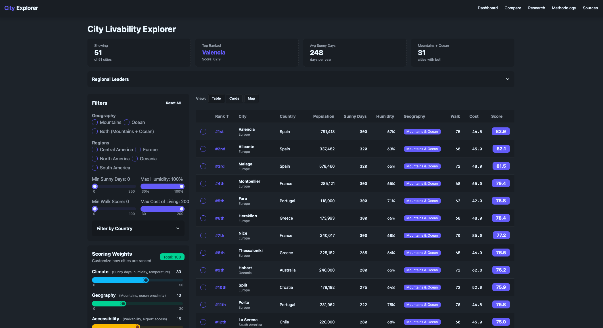

# README

This is a toy app built to make some research done by AI tools more friendly and easier to explore.  The rankings mean nothing, the data may be wrong, and this is not something that we're publishing as a website anywhere.  The tool itself was built in about three hours and shows how sometimes AI can make some things that are pretty good.  But also, user beware.

I'm making this public only to help my own workflow when I want to look at it.

